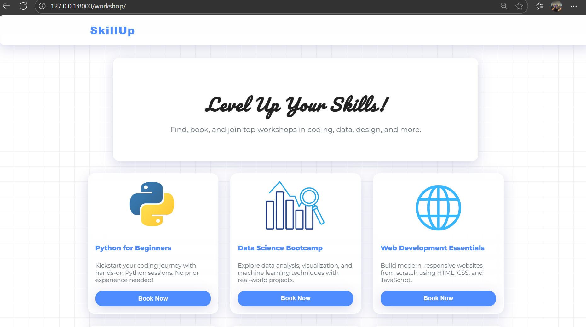
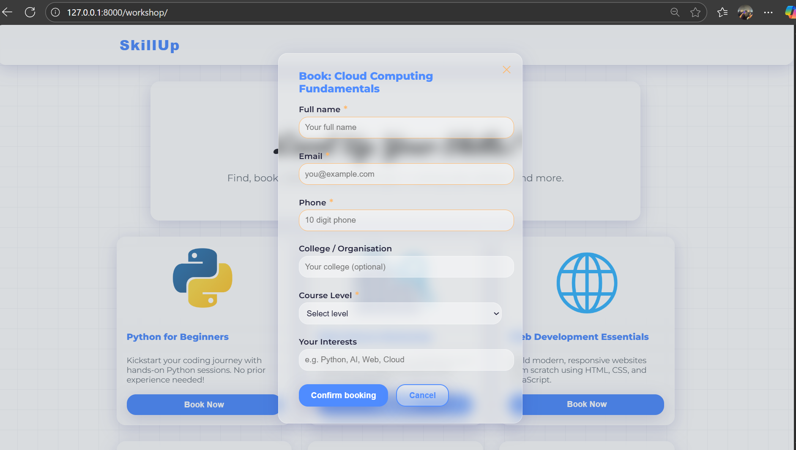
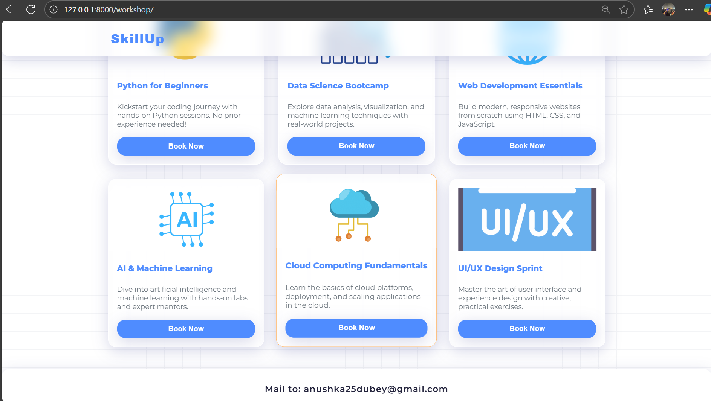
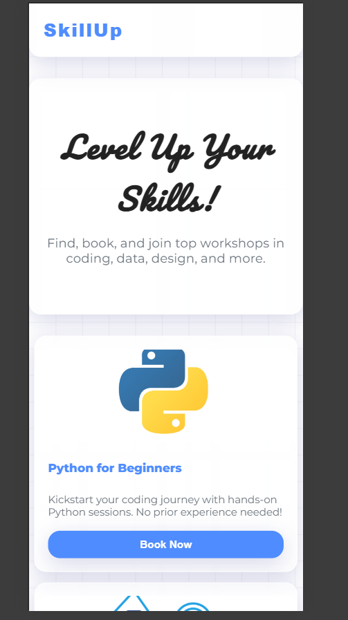

# **Workshop Booking**

> This website is for coordinators and instructors to book and manage workshops. Students primarily access it on mobile devices, so the design is optimized for readability, navigation, and fast performance.

---

## Visual Showcase

#### On Big Screen:




#### On Mobile Screen:
<table>
  <tr>
    <td align="center"><br>Mobile Screenshot 1</td>
    <td align="center"><br>Mobile Screenshot 2</td>
  </tr>
</table>

---

## Setup Instructions

### Guide to install and get this website running

> __NOTE__: Use Python3 

1. **Clone this repo**
    ```
    git clone https://github.com/FOSSEE/workshop_booking.git
    ```

2. **Create a virtual environment and install all the required packages from requirements.txt**
    ```
    python -m venv .venv
    .\.venv\Scripts\activate   # On Windows
    pip install -r requirements.txt
    ```

3. **Make Migrations and Migrate**
    ```
    python manage.py makemigrations
    python manage.py migrate
    ```

4. **Create Super User**
    ```
    python manage.py createsuperuser
    ```

5. **Start Server**
    ```
    python manage.py runserver
    ```

6. **Goto admin page and login using superuser credentials**
    - [http://localhost:8000/admin](http://localhost:8000/admin)

7. **Goto Groups and create one group called `instructor` and give it all permissions.**

8. **By default when a user registers, he is assigned a coordinator position.**
    - Using the admin panel, set the required user's profile position as instructor and add him/her in instructor group along with the required permissions.

9. **Under `settings.py` file see to it that all required variables are set then you're good to go!**

10. **To see the frontend open the localhost/workshop/**
### Instructor specific steps

1. An instructor can create workshops as per his/her availability in **Create Workshop** tab.
2. Instructor can see monthly workshop count, upcoming workshop etc. in Statistics > Workshop Statistics.
3. Instructors can view and post comments on coordinator's profile from Profile Statistics or Workshop Status page.

### Coordinator specific steps

1. A coordinator can send workshop proposal based on his/her convenience under Workshops > Propose a Workshop option.

---

## Reasoning Behind Design Choices

### What design principles guided your improvements?
This design is focused on clarity, simplicity,and accessibility. Readability was improved with larger, legible fonts and high-contrast colors. Navigation is streamlined with a clear buttons and a mobile-friendly layout for students. Visual hierarchy is enhanced using distinct headings, card layouts, and spacing to guide users through the booking process.

### How did you ensure responsiveness across devices?
Responsiveness was achieved using CSS grid and flexbox and media queries to adapt layouts for different screen sizes(mobiles/ laptops). All interactive elements, such as buttons and forms, were sized and spaced for easy use on touchscreens to increase dability and navigation on small screens. The modal and navigation components were tested to ensure usability on both mobile and desktop devices.

### What trade-offs did you make between the design and performance?
To maintain fast load times, only lightweight PNG icons and minimal CSS effects were used. No external frameworks were added like react or bootstrap, keeping the codebase lean. Some advanced visual effects were simplified or omitted to prioritize speed and accessibility, ensuring the site loads quickly even on slower mobile data connections.

### What was the most challenging part of the task and how did you approach it?
The most challenging part was to set up the reposistory and balancing a visually appealing design with optimal performance and accessibility for mobile screen. This challenge was addressed by iteratively testing the ui on various devices, optimizing images, and refining the CSS to ensure both aesthetics and usability were maintained without sacrificing speed.

---

**Submitted by:**  
Anushka Dubey  
anushka25dubey@gmail.com

---

## Submission Checklist

- [x] Code is readable and well-structured
- [x] Git history shows progressive work (no single commit dumps)
- [x] README includes reasoning answers and setup instructions
- [x] Screenshots or live demo link included
- [x] Code is documented where necessary
